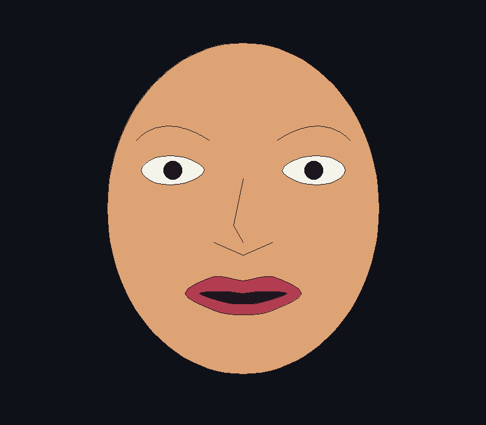

# FaceCG — Real-time face drawing with OpenGL

A C++17 Computer Graphics demonstration: selected face landmarks drive a
stylized 2D face, with independently demonstrable raster algorithms.

MediaPipe is used only for facial landmark detection.
All displayed facial geometry is produced using self-implemented
Computer Graphics algorithms and rendered through OpenGL.

## Architecture and structure

`OpenCV camera → MediaPipe → selected landmarks → pixel mapping → EMA smoothing
→ FaceModel → manual CG algorithms → point batches → OpenGL`

- `include/core`: simple point, color, and configuration types.
- `include/cg`, `src/cg`: independent DDA, Bresenham, cubic Bézier, open/closed
  Catmull-Rom, and active-edge scan-line fill.
- `include/face`, `src/face`: centralized landmark indices, mapping, smoothing,
  static/live feature geometry, and an isolated native MediaPipe provider.
- `include/rendering`, `src/rendering`: GLFW/OpenGL point display only.
- `tests`: deterministic core checks and a software pixel preview for visual QA.
- `models/face_landmarker.task`: official model, required only for live mode.
- `docs/DEPENDENCIES.md`: dependency proof and outstanding integration status.

No shaders, textures, 3D reconstruction, recognition, training, or networking are
part of the application. OpenCV performs capture and BGR-to-RGB conversion only.

## Dependencies and build

Use CMake 3.20+, a C++17 compiler, OpenGL 2.1 compatibility support, GLFW 3.3+.
Live mode additionally requires OpenCV core/imgproc/videoio and the native
MediaPipe FaceLandmarker with all transitive dependencies. GLAD is unnecessary
for the legacy point API used here. Windows/MSYS2 UCRT64 and Linux are supported
by the build structure; runtime verification status is documented separately.

From this `FaceCG` directory in PowerShell with the MSYS2 tools on PATH:

```powershell
$env:PATH = 'C:\msys64\ucrt64\bin;' + $env:PATH
cmake -S . -B build -G Ninja -DCMAKE_BUILD_TYPE=Release
cmake --build build
ctest --test-dir build --output-on-failure
.\build\FaceCG.exe --static
```

Algorithms can be built without any graphics/camera SDK:

```text
cmake -S . -B build-core -DFACECG_BUILD_APP=OFF
cmake --build build-core
ctest --test-dir build-core --output-on-failure
```

### Native live configuration

The supplied Windows build calls the official MediaPipe native DLL directly
from C++ through its C API. No Python runtime or process is used. See
`docs/DEPENDENCIES.md` and `docs/DOWNLOADS.md` for versions, provenance, and source
build failures. To restore native downloads, run `download-native-dependencies.ps1`
in PowerShell 7. With the supplied files present:

```text
cmake -S . -B build-live -G Ninja -DCMAKE_BUILD_TYPE=Release -DFACECG_ENABLE_LIVE=ON -DFACECG_BUILD_CAMERA_PROBE=ON
cmake --build build-live
build-live/FaceCG --live --model models/face_landmarker.task --camera 0
```

On Windows, `run-live.ps1` performs these steps; `run-static.ps1` builds and runs
the independent static application. On other platforms, set
`FACECG_MEDIAPIPE_INCLUDE` and `FACECG_MEDIAPIPE_LIBRARY` to a matching native SDK.

Use `.exe` on Windows. Missing model/camera/SDK produces an explicit error.
`--help` lists options. `--frames N` limits a run for smoke testing.

## Keyboard controls

| Key | Demonstration |
|---|---|
| 1 | DDA lines in all directions |
| 2 | Bresenham lines in all directions |
| 3 | Cubic Bézier with control polygon |
| 4 | Open and closed Catmull-Rom |
| 5 | Concave polygon scan-line filling |
| 6 | Full face |
| F | Toggle filling |
| M | Toggle horizontal mirroring, reset smoothing |
| S | Static backup, release camera |
| C | Start/retry camera in a live-enabled build |
| Esc | Exit |

Static mode is the default and never opens a camera or model. The title shows
mode, live/static/error status, and measured frame rate. No face clears the
rendering and resets smoothing. Resizing and mirroring reset smoothing to avoid
interpolating between incompatible coordinate systems.

## Algorithm explanation

DDA uses max(|dx|,|dy|) steps and rounded floating increments. Bresenham maintains
an integer error with signed steps for all octants. Bézier samples the cubic
Bernstein polynomial; consecutive samples are rasterized with Bresenham.
Catmull-Rom interpolates control points, duplicates open endpoints, and wraps
closed controls cyclically. Scan-line fill builds an edge table, maintains
active intersections, and fills pairs under the even-odd rule at pixel centers;
horizontal edges are skipped and upper endpoints are excluded.

Face/eyes/lips use closed splines. Eyebrows use Bézier. Nose bridge uses DDA and
nose base uses Bresenham. Small pupils are clipped to eye interiors. Fills are
drawn before pupils and feature outlines. The face oval uses 97 sampled boundary
points. Static/demo geometry is cached until size or controls change; live
geometry is rebuilt only for detected faces. The 20–30 FPS live target must be
measured on a working inference installation.

## Validation and screenshots



To test OpenCV independently of MediaPipe, configure with
`-DFACECG_BUILD_CAMERA_PROBE=ON` and run `build/facecg_camera_probe` (append `.exe`
on Windows). An optional camera index is the first argument.

`facecg_tests` checks all line directions, endpoints/connectivity, curve
interpolation, closure, scan-line coverage against independent ray casting,
mapping, smoothing, invalid input, and model/geometry integration.
`facecg_preview preview.ppm` writes the generated face pixels without OpenGL;
an optional second argument 1–5 exports an algorithm demo. This is a test utility,
not an alternative application renderer.

External proofs: `--probe-gl` reads back the known rendered pixel at (100,100),
`--probe-camera` requires 60 nonempty frames, and `--probe-landmarks` requires a
detected moving face during 150 frames. Live acceptance still requires manual
blink, mouth, head movement, mirror, and no-face testing.

## Known limitations

The bundled native MediaPipe integration targets Windows x64 with MinGW. Other
platform/compiler combinations need compatible SDK libraries. See dependency notes
for exact current blockers and verified checks. One face only, simple pupils,
no photorealism. Camera aspect ratio is mapped to the whole drawing canvas.
Legacy GL point batching intentionally prioritizes clear algorithms over GPU
optimization. Integer coordinate inputs should stay within ordinary viewport
dimensions; algorithm APIs are not intended for unbounded hostile coordinates.

